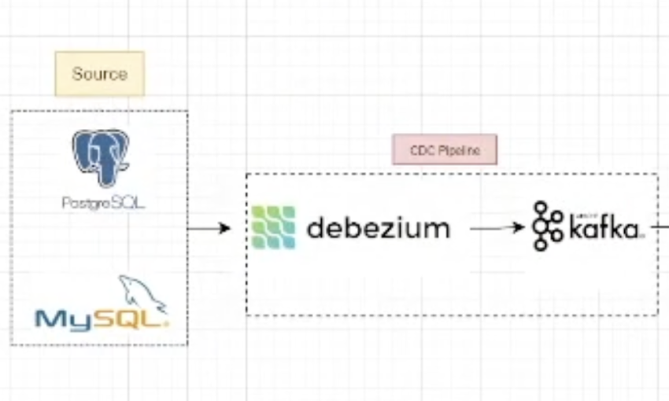

# Change-Data-Capture-with-Debezium
Change Data Capture using Debezium with data quality

## Flow of Execution
   1. Set up Debezium connector for Postgres
   2. Kafka consumer reads CDC events from Debezium topic
   3. Validate each record with configurable quality checks
   4. Route valid records to downstream topic, invalid to DLQ topic
   5. Add alerting and metrics

```

┌──────────┐     WAL      ┌──────────┐    CDC Events    ┌─────────────┐
│ Postgres │─────────────▶│ Debezium │───────────────-─▶│ Kafka Topic │
└──────────┘              └──────────┘                  │ cdc.public. │
                                                        │   orders    │
                                                        └──────┬──────┘
                                                                │
                                                                ▼
                                                    ┌───────────────────────┐
                                                    │  Quality Consumer     │
                                                    │  (consumer.py)        │
                                                    │                       │
                                                    │  ┌─────────────────┐  │
                                                    │  │  Validators     │  │
                                                    │  │  • Null check   │  │
                                                    │  │  • Type check   │  │
                                                    │  │  • Range check  │  │
                                                    │  │  • Email format │  │
                                                    │  │  • Freshness    │  │
                                                    │  └────────┬────────┘  │
                                                    └───────────┼───────────┘
                                                           ┌────┴────┐
                                                           │         │
                                                      ✅ Valid   ❌ Invalid
                                                           │         │
                                                           ▼         ▼
                                                    ┌──────────┐ ┌──────────┐
                                                    │validated.│ │data-     │
                                                    │orders    │ │quality-  │
                                                    │(downstream)│ │dlq     │
                                                    └──────────┘ └────┬─────┘
                                                                      │
                                                              ┌───────┴───────┐
                                                              │ Alert (Slack) │
                                                              │ + Metrics     │
                                                              │ (Prometheus)  │
                                                              └───────────────┘
```

### Reference for building Debezium connector - [Debezium-connector](https://debezium.io/documentation/reference/stable/connectors/postgresql.html#debezium-connector-for-postgresql)

## To start with, 
#### 1. Start infrastructure
docker-compose up -d

#### 2. Wait ~30s, then create tables
psql -h localhost -U postgres -d mydb -f init.sql

#### 3. Register Debezium connector
chmod +x register_connector.sh
./register_connector.sh

#### 4. Install Python deps
pip install -r requirements.txt

#### 5. Run the quality consumer
python main.py

#### 6. Test — insert bad data in Postgres
psql -h localhost -U postgres -d mydb -c \
  "INSERT INTO orders (customer_id, amount, currency, status) VALUES (NULL, -50, 'XXX', 'bad_status');"

#### 7. Check DLQ
kafka-console-consumer --bootstrap-server localhost:9092 --topic data-quality-dlq --from-beginning

#### 8. Check metrics
curl http://localhost:8000/metrics

After successful Debezium container startup, debezium_offsets, debezium_configs, debezium_statuses kafka topics are created from Debezium with same cleanup policy

The logs from Debezium container:
```
2026-03-02 16:43:11 2026-03-02 11:13:11,112 INFO   ||  REST resources initialized; server is started and ready to handle requests   [org.apache.kafka.connect.runtime.rest.RestServer]
2026-03-02 16:43:11 2026-03-02 11:13:11,112 INFO   ||  Kafka Connect started   [org.apache.kafka.connect.runtime.Connect]
2026-03-02 16:43:11 2026-03-02 11:13:11,310 INFO   ||  [Worker clientId=connect-1, groupId=debezium-connect] Discovered group coordinator kafka:29092 (id: 2147483646 rack: null)   [org.apache.kafka.connect.runtime.distributed.WorkerCoordinator]
2026-03-02 16:43:11 2026-03-02 11:13:11,311 INFO   ||  [Worker clientId=connect-1, groupId=debezium-connect] Rebalance started   [org.apache.kafka.connect.runtime.distributed.WorkerCoordinator]
2026-03-02 16:43:11 2026-03-02 11:13:11,311 INFO   ||  [Worker clientId=connect-1, groupId=debezium-connect] (Re-)joining group   [org.apache.kafka.connect.runtime.distributed.WorkerCoordinator]
2026-03-02 16:43:11 2026-03-02 11:13:11,319 INFO   ||  [Worker clientId=connect-1, groupId=debezium-connect] Request joining group due to: rebalance failed due to 'The group member needs to have a valid member id before actually entering a consumer group.' (MemberIdRequiredException)   [org.apache.kafka.connect.runtime.distributed.WorkerCoordinator]
2026-03-02 16:43:11 2026-03-02 11:13:11,319 INFO   ||  [Worker clientId=connect-1, groupId=debezium-connect] (Re-)joining group   [org.apache.kafka.connect.runtime.distributed.WorkerCoordinator]
2026-03-02 16:43:11 Mar 02, 2026 11:13:11 AM org.glassfish.jersey.internal.inject.Providers checkProviderRuntime
2026-03-02 16:43:11 WARNING: A provider org.apache.kafka.connect.runtime.rest.resources.RootResource registered in SERVER runtime does not implement any provider interfaces applicable in the SERVER runtime. Due to constraint configuration problems the provider org.apache.kafka.connect.runtime.rest.resources.RootResource will be ignored. 
2026-03-02 16:43:11 Mar 02, 2026 11:13:11 AM org.glassfish.jersey.internal.inject.Providers checkProviderRuntime
```

### Register the connector 

```
Manideep@Change-Data-Capture-with-Debezium % ./register_connector.sh       
{"name":"postgres-connector","config":{"connector.class":"io.debezium.connector.postgresql.PostgresConnector","database.hostname":"postgres","database.port":"5432","database.user":"postgres","database.password":"postgres","database.dbname":"mydb","topic.prefix":"cdc","table.include.list":"public.orders,public.customers","plugin.name":"pgoutput","slot.name":"debezium_slot","publication.name":"dbz_publication","decimal.handling.mode":"string","time.precision.mode":"connect","name":"postgres-connector"},"tasks":[],"type":"source"}%                                                                                          
Manideep@Change-Data-Capture-with-Debezium % 

```

Logs after running the postgreSQL command - psql -U postgres -d mydb -c \
  "INSERT INTO orders (customer_id, amount, currency, status) VALUES (NULL, -50, 'XXX', 'bad_status');

```
> python3 main.py
2026-03-02 19:39:13 | INFO     | metrics | Metrics server started on port 8000
heloo #########################################
2026-03-02 19:39:13 | INFO     | __main__ | Prometheus metrics available at http://localhost:8000/metrics
2026-03-02 19:39:13 | INFO     | kafkaconsumer | Subscribed to topics: ['cdc.public.orders', 'cdc.public.customers']
2026-03-02 19:39:13 | INFO     | kafkaconsumer | DLQ topic: data-quality-dlq
2026-03-02 19:39:13 | INFO     | kafkaconsumer | Consumer started. Waiting for messages…
2026-03-03 12:15:13 | WARNING  | dlq_handler | Record sent to DLQ | topic=cdc.public.orders | key=b'{"schema":{"type":"struct","fields":[{"type":"int32","optional":false,"default":0,"field":"id"}],"optional":false,"name":"cdc.public.orders.Key"},"payload":{"id":10}}' | errors=1
2026-03-03 12:15:13 | ERROR    | kafkaconsumer | Invalid record → DLQ | topic=cdc.public.orders | key=None | errors=[{'check': 'payload_exists', 'field': 'after', 'severity': 'critical', 'message': "Event has no 'after' payload"}]
```

The logs in DLQ kafka topic
```
sh-4.4$ kafka-console-consumer --bootstrap-server localhost:9092 --topic data-quality-dlq --from-beginning
{"original_topic": "cdc.public.customers", "original_key": "{\"schema\":{\"type\":\"struct\",\"fields\":[{\"type\":\"int32\",\"optional\":false,\"default\":0,\"field\":\"id\"}],\"optional\":false,\"name\":\"cdc.public.customers.Key\"},\"payload\":{\"id\":1}}", "original_value": {"schema": {"type": "struct", "fields": [{"type": "struct", "fields": [{"type": "int32", "optional": false, "default": 0, "field": "id"}, {"type": "string", "optional": false, "field": "name"}, {"type": "string", "optional": false, "field": "email"}, {"type": "string", "optional": true, "default": "active", "field": "status"}, {"type": "int64", "optional": true, "name": "org.apache.kafka.connect.data.Timestamp", "version": 1, "default": 0, "field": "created_at"}], "optional": true, "name": "cdc.public.customers.Value", "field": "before"}, {"type": "struct", "fields": [{"type": "int32", "optional": false, "default": 0, "field": "id"}, {"type": "string", "optional": false, "field": "name"}, {"type": "string", "optional": false, "field": "email"}, {"type": "string", "optional": true, "default": "active", "field": "status"}, {"type": "int64", "optional": true, "name": "org.apache.kafka.connect.data.Timestamp", "version": 1, "default": 0, "field": "created_at"}], "optional": true, "name": "cdc.public.customers.Value", "field": "after"}, {"type": "struct", "fields": [{"type": "string", "optional": false, "field": "version"}, {"type": "string", "optional": false, "field": "connector"}, {"type": "string", "optional": false, "field": "name"}, {"type": "int64", "optional": false, "field": "ts_ms"}, {"type": "string", "optional": true, "name": "io.debezium.data.Enum", "version": 1, "parameters": {"allowed": "true,last,false,incremental"}, "default": "false", "field": "snapshot"}, {"type": "string", "optional": false, "field": "db"}, {"type": "string", "optional": true, "field": "sequence"}, {"type": "string", "optional": false, "field": "schema"}, {"type": "string", "optional": false, "field": "table"}, {"type": "int64", "optional": true, "field": "txId"}, {"type": "int64", "optional": true, "field": "lsn"}, {"type": "int64", "optional": true, "field": "xmin"}], "optional": false, "name": "io.debezium.connector.postgresql.Source", "field": "source"}, {"type": "string", "optional": false, "field": "op"}, {"type": "int64", "optional": true, "field": "ts_ms"}, {"type": "struct", "fields": [{"type": "string", "optional": false, "field": "id"}, {"type": "int64", "optional": false, "field": "total_order"}, {"type": "int64", "optional": false, "field": "data_collection_order"}], "optional": true, "name": "event.block", "version": 1, "field": "transaction"}], "optional": false, "name": "cdc.public.customers.Envelope", "version": 1}, "payload": {"before": null, "after": {"id": 1, "name": "Alice", "email": "alice@example.com", "status": "active", "created_at": 1772460638229}, "source": {"version": "2.4.2.Final", "connector": "postgresql", "name": "cdc", "ts_ms": 1772460638231, "snapshot": "false", "db": "mydb", "sequence": "[null,\"27113520\"]", "schema": "public", "table": "customers", "txId": 746, "lsn": 27113520, "xmin": null}, "op": "c", "ts_ms": 1772460638549, "transaction": null}}, "errors": [{"check": "payload_exists", "field": "after", "severity": "critical", "message": "Event has no 'after' payload"}], "warnings": [], "error_count": 1, "timestamp": 1772460638693, "dlq_reason": "data_quality_validation_failed”}
```

## FULL CDC DATA QUALITY PIPELINE       
```




  ┌──────────────────┐
  │    APPLICATION   │
  │   (CRUD Ops)     │
  │                  │
  │  INSERT/UPDATE/  │
  │  DELETE          │
  └────────┬─────────┘
           │
           ▼
  ┌──────────────────┐
  │    POSTGRESQL    │
  │                  │
  │  ┌────────────┐  │
  │  │   Tables   │  │
  │  │ • orders   │  │
  │  │ • customers│  │
  │  └────────────┘  │
  │                  │
  │  ┌────────────┐  │
  │  │  WAL Log   │──┼──── Write-Ahead Log (every row change recorded)
  │  │  (pg_wal/) │  │
  │  └────────────┘  │
  └────────┬─────────┘
           │
           │  Logical Replication Slot (pgoutput plugin)
           │  Reads WAL without polling tables
           │
           ▼
  ┌──────────────────┐
  │    DEBEZIUM      │
  │  (Kafka Connect) │
  │                  │
  │  • Reads WAL     │
  │  • Converts to   │
  │    CDC events    │
  │  • Serializes    │
  │    (JSON/Avro)   │
  │                  │
  │  Event format:   │
  │  {               │
  │   "before": {},  │
  │   "after": {},   │
  │   "op": "c/u/d", │
  │   "ts_ms": ...   │
  │   "source": {}   │
  │  }               │
  └────────┬─────────┘
           │
           │  Produces to Kafka
           │
           ▼
  ┌────────────────────────────────────────────────────────────┐
  │                        APACHE KAFKA                        │
  │                                                            │
  │  ┌─────────────────┐  ┌─────────────────┐                  │
  │  │ cdc.public.     │  │ cdc.public.     │  Source Topics   │
  │  │ orders          │  │ customers       │  (Debezium)      │
  │  └────────┬────────┘  └────────┬────────┘                  │
  │           │                    │                           │
  └───────────┼────────────────────┼───────────────────────────┘
              │                    │
              └─────────┬──────────┘
                        │
                        │  Consumes CDC events
                        ▼
  ┌──────────────────────────────────────────────────────────────────────┐
  │                    DATA QUALITY CONSUMER (Python)                    │
  │                                                                      │
  │   ┌──────────────────────────────────────────────────────────────┐   │
  │   │                    STEP 1: DESERIALIZE                       │   │
  │   │                                                              │   │
  │   │   Raw Kafka Message ──► JSON Parse ──► Debezium Event Dict   │   │
  │   │                                                              │   │
  │   │   Failed? ──► DLQ (deserialization error)                    │   │
  │   └──────────────────────────┬───────────────────────────────────┘   │
  │                              │                                       │
  │                              ▼                                       │
  │   ┌──────────────────────────────────────────────────────────────┐   │
  │   │                    STEP 2: EXTRACT                           │   │
  │   │                                                              │   │
  │   │   op = event["op"]        (c=create, u=update, d=delete)     │   │
  │   │   payload = event["after"] (the new row state)               │   │
  │   │                                                              │   │
  │   │   op == "d" ? ──► Skip validation (no after payload)         │   │
  │   └──────────────────────────┬───────────────────────────────────┘   │
  │                              │                                       │
  │                              ▼                                       │
  │   ┌──────────────────────────────────────────────────────────────┐   │
  │   │                    STEP 3: VALIDATE                          │   │
  │   │                                                              │   │
  │   │   ┌──────────────────┐  ┌──────────────────┐                 │   │
  │   │   │  NULL CHECKS     │  │  TYPE CHECKS     │                 │   │
  │   │   │                  │  │                  │                 │   │
  │   │   │ id != null?      │  │ id is int?       │                 │   │
  │   │   │ customer_id      │  │ amount is        │                 │   │
  │   │   │   != null?       │  │   numeric?       │                 │   │
  │   │   │ amount != null?  │  │ name is string?  │                 │   │
  │   │   └──────────────────┘  └──────────────────┘                 │   │
  │   │                                                              │   │
  │   │   ┌──────────────────┐  ┌──────────────────┐                 │   │
  │   │   │  RANGE CHECKS    │  │ ALLOWED VALUES   │                 │   │
  │   │   │                  │  │                  │                 │   │
  │   │   │ amount > 0?      │  │ status in        │                 │   │
  │   │   │ amount <         │  │  [pending,       │                 │   │
  │   │   │   1,000,000?     │  │   completed,     │                 │   │
  │   │   │                  │  │   cancelled]?    │                 │   │
  │   │   └──────────────────┘  └──────────────────┘                 │   │
  │   │                                                              │   │
  │   │   ┌──────────────────┐  ┌──────────────────┐                 │   │
  │   │   │  EMAIL FORMAT    │  │  FRESHNESS       │                 │   │
  │   │   │                  │  │                  │                 │   │
  │   │   │ email matches    │  │ event age        │                 │   │
  │   │   │   regex?         │  │   < 5 minutes?   │                 │   │
  │   │   └──────────────────┘  └──────────────────┘                 │   │
  │   │                                                              │   │
  │   │         Result: { is_valid, errors[], warnings[] }           │   │
  │   └──────────────────────────┬───────────────────────────────────┘   │
  │                              │                                       │
  │                              ▼                                       │
  │   ┌──────────────────────────────────────────────────────────────┐   │
  │   │                    STEP 4: ROUTE                             │   │
  │   │                                                              │   │
  │   │                    is_valid?                                 │   │
  │   │                   ┌────┴────┐                                │   │
  │   │                   │         │                                │   │
  │   │                 YES ✅     NO ❌                              │   │
  │   │                   │         │                                │   │
  │   │                   ▼         ▼                                │   │
  │   │           ┌──────────┐ ┌──────────────┐                      │   │
  │   │           │Downstream│ │  DLQ Handler │                      │   │
  │   │           │ Topic    │ │              │                      │   │
  │   │           └──────────┘ │ • Wrap with  │                      │   │
  │   │                        │   metadata   │                      │   │
  │   │                        │ • Track      │                      │   │
  │   │                        │   failures   │                      │   │
  │   │                        │ • Fire alert │                      │   │
  │   │                        │   if threshold│                     │   │
  │   │                        └──────────────┘                      │   │
  │   └──────────────────────────────────────────────────────────────┘   │
  │                                                                      │
  │   ┌──────────────────────────────────────────────────────────────┐   │
  │   │                    STEP 5: COMMIT                            │   │
  │   │                                                              │   │
  │   │   consumer.commit(offset)  ──► Kafka knows this msg is done  │   │
  │   └──────────────────────────────────────────────────────────────┘   │
  │                                                                      │
  └──────────────────────────────────────────────────────────────────────┘
                    │                              │
                    │                              │
                    ▼                              ▼
                  ┌──────────────────────────────────┐
                  │           APACHE KAFKA           │
                  └─────────────────┬────────────────┘
                                    │
         ┌──────────────────────────┴──────────────────────────┐
         │                          │                          │
         ▼                          ▼                          ▼
  ┌──────────────────┐     ┌──────────────────-┐     ┌──────────────────┐
  │ validated.orders │     │validated.customers│     │ data-quality-dlq │
  │                  │     │                   │     │                  │
  │  ✅ Clean data    │    │  ✅ Clean data     │     │  ❌ Bad records  │
  │                  │     │                   │     │  + error meta    │
  └────────┬─────────┘     └────────┬────────-─┘     └────────┬─────────┘
           │                        │                         │
           ▼                        ▼                         ▼
  ┌────────────────────────────────────┐     ┌────────────────────────────────────┐
  │        DOWNSTREAM CONSUMERS        │     │           DLQ CONSUMERS            │
  │                                    │     │                                    │
  │  ┌──────────────┐  ┌─────────────┐ │     │  ┌──────────────────────────────┐  │
  │  │Data Warehouse│  │Microservices│ │     │  │        Alert Service         │  │
  │  │ (Snowflake/  │  │(API, Search)│ │     │  │  • Slack                     │  │
  │  │  BigQuery)   │  │             │ │     │  │  • PagerDuty                 │  │
  │  └──────────────┘  └─────────────┘ │     │  └──────────────────────────────┘  │
  │                                    │     │                                    │
  │  ┌──────────────┐  ┌─────────────┐ │     │  ┌──────────────────────────────┐  │
  │  │  Analytics   │  │    Cache    │ │     │  │      DLQ Replay Service      │  │
  │  │  Dashboard   │  │   (Redis)   │ │     │  │                              │  │
  │  │              │  │             │ │     │  │  Fix → Replay back to source │  │
  │  └──────────────┘  └─────────────┘ │     │  └──────────────────────────────┘  │
  │                                    │     │                                    │
  └────────────────────────────────────┘     └────────────────────────────────────┘
  ┌────────────────────────────────────────────────────────────────────────────┐
  │                            OBSERVABILITY LAYER                             │
  │                                                                            │
  │    ┌───────────────────────────────┐  ┌───────────────────────────────┐    │
  │    │          PROMETHEUS           │  │              LOGS             │    │
  │    │                               │  │                               │    │
  │    │  Metrics:                     │  │  • cdc_quality.log            │    │
  │    │  • records_processed          │  │  • Structured JSON            │    │
  │    │  • records_valid              │  │  • Per-record errors          │    │
  │    │  • records_invalid            │  │                               │    │
  │    │  • records_dlq                │  │     ┌───────────────────┐     │    │
  │    │  • quality_score              │  │     │    ELK / Loki     │     │    │
  │    │  • processing_latency         │  │     │ (Log aggregation) │     │    │
  │    └───────────────────────────────┘  │     └───────────────────┘     │    │
  │                                       └───────────────────────────────┘    │
  │                                                                            │
  │  Metrics endpoint: http://localhost:8000/metrics                           │
  └────────────────────────────────────────────────────────────────────────────┘


  ┌────────────────────────────────────────────────────────────────────────────┐
  │                            DLQ RECORD STRUCTURE                            │
  │                                                                            │
  │  {                                                                         │
  │    "original_topic": "cdc.public.orders",                                  │
  │    "original_key": "123",                                                  │
  │    "original_value": {                                                     │
  │      "before": null,                                                       │
  │      "after": {                                                            │
  │        "id": 5,                                                            │
  │        "customer_id": null,        ◄── This caused the failure             │
  │        "amount": -50,              ◄── This too                            │
  │        "currency": "XXX",          ◄── And this                            │
  │        "status": "bad_status"      ◄── And this                            │
  │      },                                                                    │
  │      "op": "c",                                                            │
  │      "ts_ms": 1700000000000                                                │
  │    },                                                                      │
  │    "errors": [                                                             │
  │      {"check": "null_check", "field": "customer_id", ...},                 │
  │      {"check": "range_check", "field": "amount", ...},                     │
  │      {"check": "allowed_values", "field": "currency", ...},                │
  │      {"check": "allowed_values", "field": "status", ...}                   │
  │    ],                                                                      │
  │    "warnings": [],                                                         │
  │    "error_count": 4,                                                       │
  │    "timestamp": 1700000005000,                                             │
  │    "dlq_reason": "data_quality_validation_failed"                          │
  │  }                                                                         │
  └────────────────────────────────────────────────────────────────────────────┘

```
